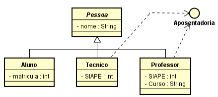

# Lista de Exercícios: Herança, Polimorfismo, Classe Abstrata e Interface

## Resumo
Exercícios que contêm os paradigmas da orientação a objetos.

## Configuração
A ferramenta utilizada para esta atividade é o [Visual Studio Code](https://code.visualstudio.com/download).

## Exercícios

### [Exercício 01](./exercicio_01)

A livraria CC trabalha com a venda de livros, revistas e dvds, onde cada produto da livraria tem, no mínimo, os seguintes atributos: código, nome e valor. Além dos atributos comuns de todos os produtos, cada tipo de produto possui os seguintes atributos extras:

|   Tipo  	| Atributos extras 	|
|:-------:	|------------------	|
|  Livro  	| Autor, editora   	|
| Revista 	| Editora          	|
|   DVD   	| Autor, estilo    	|

(a) Escreva uma classe abstrata que modela o comportamento de qualquer produto da livraria.

(b) Escreva as classes que modelam o tipo de produto Livro, Revista e DVD, com seus atributos, construtores e métodos de acesso. **(Use os conceitos de herança e polimorfismo quando possível)**

(c) Escreva o método main que: (use os conceitos de herança e polimorfismo quando possível)
* instancia duas revistas (r1 e r2);
* modifica o atributo valor de r1 para R$ 10,00 (dez reais);
* modifica o atributo nome de r2 para “Info Exame”;
* modifica o atributo editora de r2 para “Globo”;

(d) Escreva uma interface IListaProdutos que permita incluir, consultar e remover produtos da livraria.

(e) Escreva uma classe ListaProdutos que implementa a interface IListaProdutos

(f) Escreva o método main que: (use os conceitos de herança e polimorfismo quando possível)
* instancia diferentes tipos de produtos da livraria;
* adiciona os produtos na lista de produtos da livraria;
* lista todos os produtos da livraria;

### [Exercício 02](./exercicio_02)

Com as novas regras de aposentadoria, a UNIPAMPA precisa calcular o tempo mínimo de contribuição para cada um de seus servidores. Para isso, existe a interface Aposentadoria. Essa Interface é interpretada da seguinte maneira: "todos os servidores vinculados à UNIPAMPA (técnicos e professores) precisam saber calcular o tempo mínimo de contribuição, devolvendo um int correspondente ao número de anos". Técnicos devem contribuir no mínimo 30 anos, enquanto professores 20 (essa informação é meramente para contextualizar a questão e não corresponde à realidade). O sistema utilizado pela UNIPAMPA é representado pelo seguinte diagrama de classes:

<figure><figcaption>Diagrama de Classes</figcaption></figure>

<pre>
class abstract Pessoa {
    private String nome;

    public Pessoa(String nome){
        this.nome = nome;
    }

    public String getNome(){return nome;}
}
</pre>

<pre>
interface Aposentadoria {
    int calculaTempoMinimo();
}
</pre>

a) Escreva a classe Tecnico a fim de que ela herde atributos e métodos da classe Pessoa, de acordo com o diagrama acima.

b) Escreva a classe Professor, de acordo com o diagrama acima.